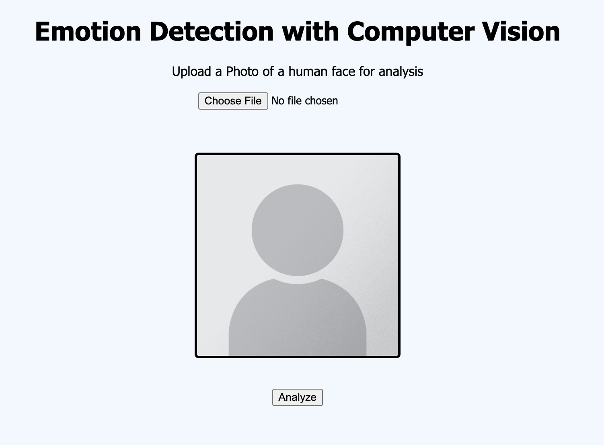

# Emotion Detection with Computer Vision

A Javascript Vite+React Web application with a Python FastAPI server that uses the py-feat computer vision library to detect emotions from still photos of human faces.

## Objective

This application is to create a simple web interface in which users can upload a photo of their choice, and have that photo be analyzed by an AI model. 

## Stack

- Frontend: A Javascript/Node React Application that uses Vite as a build tool
- Server: Python FastAPI
- Key Integrations:
    - [Py-feat Computer Vision Model](https://py-feat.org/)

Instructions to run the application locally, and dev environment requirements can be found in the README file for each application component.

[Frontend README](https://github.com/kfemelue/Emotion-Detection-with-Computer-Vision/blob/main/Frontend/README.md)

[Backend README](https://github.com/kfemelue/Emotion-Detection-with-Computer-Vision/blob/main/Backend/README.md)

## Sample Results

